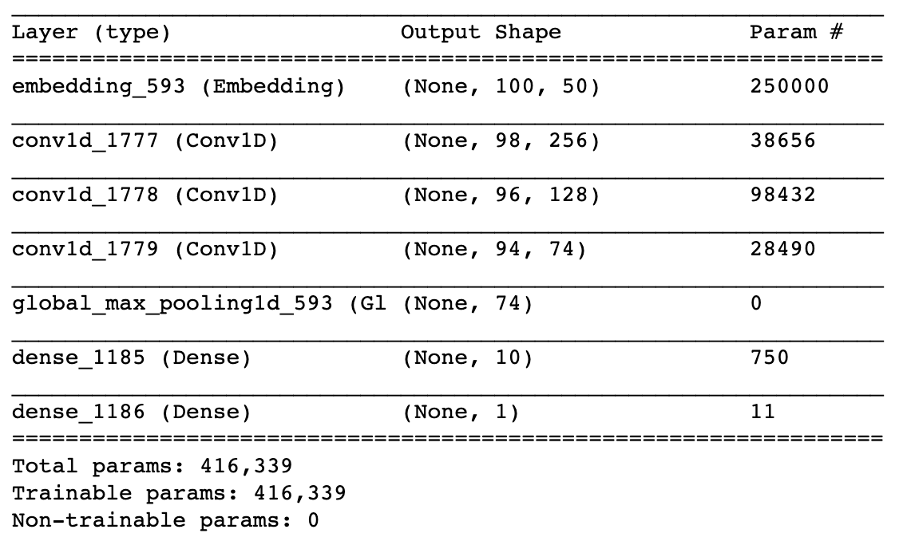
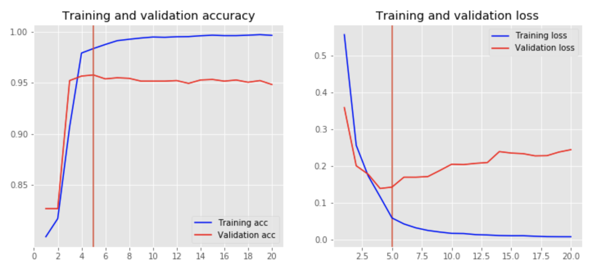

# Using NLP for Cannabis Classification
## Creating Conda Environment
After cloning the repository, please run
```
conda env create -f environment.yml
```
to create the conda environment, then
```
conda activate deep_wa
```
to activate the environment. The Jupyter Notebook will then have all the installed libraries to run the code.

## Task and Data
We have a collection of cannabis product descriptions. The target variables 

* Cannabinoid
* Genetics
* Intoxication
* Look
* Medical
* Smell Flavor
* Wellness
* Commoditization

have all been hand-labelled.

The data is divided into 2 main files:
* in_sample.csv - contains the dataset of around 10,000 observations
* out_sample.csv - contains the dataset of around 5,500 observations

We train the machine learning models on the in_sample.csv dataset and test it on the out_sample.csv dataset. After training, the python code will automatically save the results to the `metrics` folder.

## Methods
We use a TextCNN for making predictions. The model consists of an embedding layer, 3 convolution layers, 1 max pooling layer and 2 fully-connected layers which outputs the probabilities for classification. 

This specific model has been chosen after experimentation. A smaller and simpler model with less parameters failed to achieve a high level accuracy even after training for a lot of epochs probably because it could not capture the whole complexity of our dataset. On the other hand, larger models with more convolutions and fully connected layers took too long to train. We think that the chosen model was appropriate to achieve high accuracy and f1 scores while not being too computationally expensive to train. A sample network is shown below:



The first layers embeds words into low-dimensional vectors. This essentially maps vocabulary word indices into low-dimensional vector representations and becomes a lookup table that we learn from data. The next layer performs convolutions over the embedded word vectors using multiple filter sizes. For example, sliding over 2 or 3 words at a time.

For more information on the model please see:

https://adventuresinmachinelearning.com/word2vec-tutorial-tensorflow/


### Metrics
We keep track of the performance of our models with different statistics: 

`model_name`, `pred_true`, `pred_false`, `actual_true`, `actual_false`, `accuracy`, `precision`, `recall`, `f1`, `sensitivity`, `specificity`, `informedness`, `matthews_correlation`, `cohen_kappa`, `roc_auc`, `tn`, `fp`, `fn`, `tp`

### Early Stopping
We train our model for 20 epochs but we find that our model performs better on the validation set in the early epochs and its performance tends to degrade in the later ones. This is clearly a sign of overfitting to the training set. Hence, we implement early stopping to stop training the model when it sees no significant improvement in the validation accuracy. The graph below shows how the model performs over 20 epochs. The orange line is where our model stops training.



### Hyperparameter Tuning
To find the optimal set of hyperparameters of our model, we perform a random search. Given the model complexity, we cannot test out all the different combinations of hyperparameters. Instead, we randomly sample a set of hyperparameters and test the model. The prediction summaries of all the models are saved into the 'metrics' folder and the best models are chosen afterwards.

Hyperparameters of the model that we experimented with:
* num_filters: the number of filters per filter size
* kernel_size: the number of words we want our convolutional filters to cover. We will have num_filters for each size specified here. For example, [2, 3] means that we will have filters that slide over 2 and 3 words respectively.
* dilation: skip size of the convolution on the embedding
* vocab_size: the size of our vocabulary. This is needed to define the size of our embedding layer, which will have shape [vocabulary_size, embedding_size]
* embedding_dim: the dimensionality of our embeddings
* maxlen: maximum number of words kept in the product description

We infer from the different models we have trained the best hyperparameters of the model. Obviously, each `label` has its own best model but in general for a better performance we need:
* a higher dilation
* longer descriptions
* smaller validation set size
* smaller embedding dimension
* smaller kernel size

### Results
We achieve an f1 score of above 0.8 on the outsample model for all the `labels` except for `Look`. 


