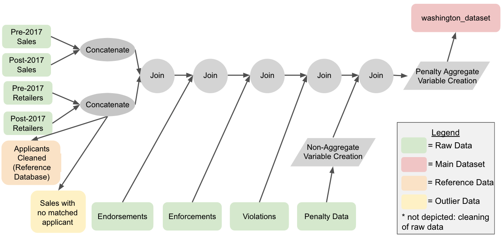
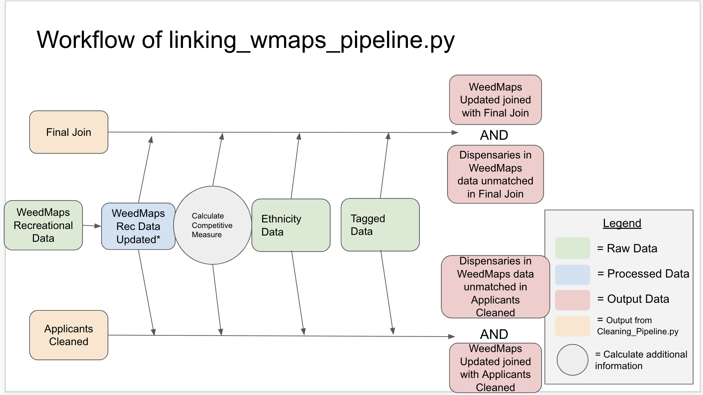

# team2_f20_wa

## Running Locally

### Environment
If you do not already have conda installed, follow the instructions [here](https://docs.conda.io/projects/conda/en/latest/user-guide/install/).
Once you have it:

    conda env create --file wa_pipeline_env.yml
    conda activate wa_pipeline_env

 ### Running

    ./run_wa

 ### Troubleshooting
 In case you get Permission Denied error, run the following command. You only need to do this once and it should be granted permission.

    chmod +x ./run_wa
    
## Washington Data Pipeline Overview
    
## Repository Structure

- `Raw_Data`: contains all raw data files that are used to create the final dataset
	- Sales:
		- `2021-04-06-MJ-Sales-Activity-by-License-Number-Traceability-Contingency-Reporting-Retail.csv` (Sales 2017 and onward)
			- `2021-06-09-MJ-Sales-Activity-by-License-Number-Traceability-Contingency-Reporting-Retail.csv` (old Sales data for 2017 and onward)
		- `By-License-Number-MJ-Tax-Obligation-by-Licensee-thru-10_31_17.csv` (Sales up until 2017)
	- Applicants:
		- `MarijuanaApplicants.csv` (Retailers 2017 and onward)
		- `MarijuanaApplicants_2017.csv` (Retailers up until 2017)
		- `MarijuanaApplicants_2017_producers.csv` (Producers up until 2017)
		- `MarijuanaApplicants_2017_processors.csv` (Processors up until 2017)
	- Endorsements:
		- `MedicalMarijuanaEndorsements.csv`
	- Enforcements:
		- `Enforcement_Visits_Dataset.csv`
	- Violations:
		- `Violations_Dataset.csv`
	- Penalty:
		- `PRR_21-01-085_MJ.xlsx`
	- Area Variables (directory)
		- `Area Variables Key v6.xlsx` (Key to various files that store area variables)
		- Other files: store area variables based on Key
	- Demographics
		- `Individuals_Ownership_Demographics.csv`
	- Tagged
		- `full_dataset_with_labels.csv` (too big to store in github, find data [here](https://drive.google.com/file/d/1DL7WQyXIU_8MW05mUU1LHJbCU6ISIplB/view?usp=sharing))
	- Competitive Measure
		- `112115_62319_WAall_illegal_fixed.csv`
- `Processed_Data`: contains all intermediate outputs from the pipeline, as well as the final dataset
	- `washington_dataset.csv`: Output from `Cleaning_Pipeline.py`
	- `applicants_cleaned`: Reference output from `Cleaning_Pipeline.py` that includes all applicants
	- `sales_with_no_applicant_info.csv`: Reference output from `Cleaning_Pipeline.py` that includes all unjoined sales
	- `washington_dataset_no_duplicates.csv`: Output from `fix_wa_sales_duplicates.py`
	- `washington_dataset_with_area.csv`: Output from `area_variables.py`
	- `area_variables.csv`: Reference output from `area_variables.py` that includes variables for each county
	- 
	- **The Final Dataset** can be found at : `Processed_Data/pipeline_final_output.csv`
- `Lookup_Tables`
	- 
- `Plots`: contains png files of WA sales over time (see `Washington Data Pipeline` for more detail)
- `Images`: contains the png files for the flow charts included in this readme
- The other directories contain scripts that compute various parts of the pipeline (outlined above)

## Cleaning Pipeline

The "Cleaning Pipeline" (`Cleaning_Pipeline.py`) takes in all raw Washington datasets, cleans them, and merges them to create final output, `washington_dataset.csv`. The final output has a granularity at the level of sales per month per license # for all Marijuana Retailers. The additional information contains applicant information, medical endorsement information, enforcement information, violation information, and penalty information for all license #'s that appear in the sales datasets.

### Datasets

All datasets that are read into this script are located in the `/Raw_Data` directory.

- Pre-2017 Sales: `By-License-Number-MJ-Tax-Obligation-by-Licensee-thru-10_31_17.csv`
- Post-2017 Sales: `2021-04-06-MJ-Sales-Activity-by-License-Number-Traceability-Contingency-Reporting-Retail.csv` (old: `2020-06-09-MJ-Sales-Activity-by-License-Number-Traceability-Contingency-Reporting-Retail.csv`)
- Pre-2017 Retailers: `MarijuanaApplicants_2017.csv`
- Pre-2017 Processors: `MarijuanaApplicants_2017_processors.csv`
	- None of the Processor sales are included in the final output, but this file is used to create the reference panel `applicants_cleaned.csv`
- Pre-2017 Producers: `MarijuanaApplicants_2017_producers.csv`
	- None of the Producer sales are included in the final output, but this file is used to create the reference panel `applicants_cleaned.csv`
- Post-2017 Retailers: `MarijuanaApplicants.csv`
- Endorsements: `MedicalMarijuanaEndorsements.xls`
- Enforcements: `Enforcement_Visits_Dataset.csv`
- Violations: `Violations_Dataset.csv`
- Penalty: `PRR_21-01-085_MJ.xlsx`

### Processed Data and Plots

- `washington_dataset.csv`: Output Table (sales granularity) that gets passed forward through the pipeline
- `applicants_cleaned.csv`: cleaned reference of all applicants (set download_applicant_reference=True in main())
- `sales_with_no_applicant_info.csv`: Table with sales that had no matching applicant info (set download_sales_with_no_applicant_info=True in main())
- `Count_Without_Medical Endorsements_Over_Time.png`: plot of running count over time (set plot_medical_endorsements_over_time=True in main())
- `Proportion_Medical Endorsements_Over_Time.png`: plot of running proportion over time (set plot_medical_endorsements_over_time=True in main())
- `WA_metadata.xlsx`: Information on the columns of washington_dataset.csv

### Workflow (all performed by Cleaning_Pipeline.py)

### Penalty Variable Creation

When integrating the penalty dataset (see the `/Penalty` directory for these computations), the following features were created at the Sales granularity level:

- `FinesCnt`: Number of times fined that month year based on Type and Date Paid variables
        - Does not include if Amount Paid is “discontinued” or "warning". It only counts if there is a dollar amount
          associated with it
- `FinesAmnt`: Total amount of fines that month year based on Amount Paid
- `SuspensionDays`: Number of Days suspended that month year based on Type and Date Paid variables
	- Any amounts that contains 'days' are suspensions
        - Month-Year are based on Date Paid (end date of suspension).
        - For suspensions that spanned multiple months, a new row was created for the previous month
             - If a suspension was 30 days on February 15, the script changes the February entry to be 15 days, and it creates a new row in which there are 15 suspension days during January
- `Cancellation`: Coded 1 if Date Paid is in that Month-Year. Code 0 otherwise
        - Use 'Cancellation of License' in the "Date Paid" column to indicate cancellation count
- `Future Cancelled`: binary that indicated if a retailer is cancelled in the current Month-Year, or is going to be cancelled in the future (or has already been cancelled)
	- Note: Due to the nature of the penalty dataset, there may be some License Numbers for which the `Future Cancelled` field is 1, but the `Cancellation` field is never 1. This would occur if a cancellation occurred after the latest Month-Year sales for that License Number.
- `DiscontinuedCnt`: Number of times discontinued that Month-Year based on Date of Offense and Amount Paid
- `WarningsCnt`: Number of times warned that Month-Year based on Date Of Offense and Amount Paid
- `AvgPayLag`: Average difference between Date and Date Paid
        - filled NA values in the "Date Paid" column with median to be robust to outliers
        - Note: this field included many coding errors (ex: instances in which Date Paid occurred before Date, so this field should be verified before being included in analysis)
- FinesCntCum: Total number of fines up to and including that Month-Year
        - only includes paid fines
- `FinesAmntCum`: Total amount of fines up to and including that Month-Year
        - only includes paid fines
- `SuspensionDaysCum`: Total number of days suspended including that Month-Year
- `DiscontinuedCntCum`: Total number of times discontinued up to and including that Month-Year
- `WarningsCntCum`: Total number of warnings up to and including that Month-Year

In order to create the additional penalty features, several cleaning/preprocessing steps were performed. Firstly, the `Date Paid` column had some dates in the form "21xx-mm-dd". These were modified to be of the form "201x-mm-dd". Some other dates in the same column had the form "200x-mm-dd" - these were modified to be of the form "201x-mm-dd". Next, there were instances when "Date" occurred after "Date Paid" (coding error).  These are currently untouched in the pipeline, but it should be acknowledged that this may skew the `AvgPayLag` feature.

## Removing Duplicate Sales

In the two raw sales files (`By-License-Number-MJ-Tax-Obligation-by-Licensee-thru-10_31_17.csv` and `2021-04-06-MJ-Sales-Activity-by-License-Number-Traceability-Contingency-Reporting-Retail.csv`), there are several sales records that contains duplicate entries for the same License # and Month-Year pair. In these cases, the `Total Sales` figures differ and one is much larger than the other. Thus, the `fix_wa_sales_duplicates.py` file removes these duplicates from the `washington_dataset.csv` file by creating an `alt_sales` field that contains the smaller of the two sales figures for these edge cases. For all instances in which there are no duplicate sales, the `alt_sales` field is 0.  The script makes this correction for 41 total License # / Month-Year pairs.

Additionally, `fix_wa_sales_duplicates.py` creates the following temporal features (**Franklin to add**)
- `age`:
- `failure`:
- `sales_MoM`:
- `sales_YoY`:

### Input
- `Processed_Data/washington_dataset.csv`

### Output
- `Processed_Data/washington_dataset_no_duplicates.csv`

## Area Variables

The code for the creation of the Area variables features is in the `/Area Variables` directory. The script computes features at the Washington County Level

### Input
- Relevant datasets are in `Raw_Data/Area_Variables`.
- `Area Variables Key v6.xlsx` Each row is a variable that is to be merged into the main dataset(based on County and Year). For different years, we go to the file listed in the corresponding column to get the variable in that year.
- `Processed_Data/washington_dataset_no_duplicates.csv` - the script creates joins the area features to the sales dataset
  
### Output
- `/Processed_Data/area_variables.csv` The dataset that combines all the input datasets following the instruction in `Area Variables Key v6.xlsx` (used as a reference)
- `/Processed_Data/washington_dataset_with_area.csv` is the product of joining the area variables with the WA sales dataset (dataset that is passed through the remainder of the pipeline)

### Methodology
1. Clean the input files so that the `County` field matches the format in the main dataset 
   (does not contain WA state and in all caps.)
   
2. The key file `Area Variables Key v6.xlsx` tells us what we should look for and where we can find it.
Get all the variables requested by the key file. The result is `area_variables.csv`.
   The key file tells us both `Old Field Name` which is the name we use to locate the
   variables in the input dataset and `New Field Name` which is used in the output files.
   
3. Merge `area_variables.csv` into `washington_dataset.csv` based on `County` and `Year`.

### Old and New Field Name
`Old Field Name` are used in the input files (in `Raw_Data/Area Variables`) and
`New Field Name` are used in the output files (`area_variables.csv` and `washington_dataset_with_area.csv`)

| Old Field      | New Field Name            | Descriptor for Readme                                                                                 |
|----------------|---------------------------|-------------------------------------------------------------------------------------------------------|
| S1903_C02_001E | MHI_5y                    | Median income (dollars)!!Estimate!!Households                                                         |
| S1903_C02_002E | MHI_white_5y              | Median income (dollars)!!Estimate!!Households!!One race!!White                                        |
| S1903_C02_003E | MHI_black_5y              | Median income (dollars)!!Estimate!!Households!!One race!!Black   or African American                  |
| S1903_C02_004E | MHI_am_indian_5y          | Median income (dollars)!!Estimate!!Households!!One   race!!American Indian and Alaska Native          |
| S1903_C02_005E | MHI_asian_5y              | Median income (dollars)!!Estimate!!Households!!One race!!Asian                                        |
| S1903_C02_006E | MHI_haw_pac_5y            | Median income (dollars)!!Estimate!!Households!!One   race!!Native Hawaiian and Other Pacific Islander |
| S1903_C02_007E | MHI_other_5y              | Median income (dollars)!!Estimate!!Households!!One race!!Some   other race                            |
| S1903_C02_008E | MHI_two_plus_5y           | Median income (dollars)!!Estimate!!Households!!Two or more   races                                    |
| S1903_C02_009E | MHI_hispanic_5y           | Median income (dollars)!!Estimate!!Hispanic or Latino origin   (of any race)                          |
| S1903_C02_010E | MHI_white_not_hispanic_5y | Median income (dollars)!!Estimate!!White alone, not Hispanic   or Latino                              |
| DP05_0001E     | population_5y             | Estimate!!SEX AND AGE!!Total population                                                               |
| DP05_0002PE    | male_percent_5y           | Percent!!SEX AND AGE!!Male                                                                            |
| DP05_0003PE    | female_percent_5y         | Percent!!SEX AND AGE!!Female                                                                          |
| DP05_0017E     | age_median_5y             | Estimate!!SEX AND AGE!!Median age (years)                                                             |
| DP05_0019PE    | 21_over_5y                | Percent!!SEX AND AGE!!21 years and over                                                               |
| DP05_0022PE    | 18_over_5y                | Percent!!SEX AND AGE!!18 years and over                                                               |
| DP05_0008PE    | 20_to_24_5y               | Percent!!SEX AND AGE!!20 to 24 years                                                                  |
| DP05_0009PE    | 25_to_34_5y               | Percent!!SEX AND AGE!!25 to 34 years                                                                  |
| DP05_0010PE    | 35_to_44_5y               | Percent!!SEX AND AGE!!35 to 44 years                                                                  |
| DP05_0011PE    | 45_to_54_5y               | Percent!!SEX AND AGE!!45 to 54 years                                                                  |
| DP05_0012PE    | 55_to_59_5y               | Percent!!SEX AND AGE!!55 to 59 years                                                                  |
| DP05_0013PE    | 60_to_64_5y               | Percent!!SEX AND AGE!!60 to 64 years                                                                  |
| DP05_0021PE    | 65_over_5y                | Percent!!SEX AND AGE!!65 years and over                                                               |
| DP05_0059PE    | white_5y                  | Percent!!RACE!!White                                                                                  |
| DP05_0060PE    | black_5y                  | Percent!!RACE!!Black or African American                                                              |
| DP05_0061PE    | am_indian_5y              | Percent!!RACE!!American Indian and Alaska Native                                                      |
| DP05_0062PE    | asian_5y                  | Percent!!RACE!!Asian                                                                                  |
| DP05_0063PE    | haw_pac_5y                | Percent!!RACE!!Native Hawaiian and Other Pacific Islander                                             |
| DP05_0064PE    | other_race_5y             | Percent!!RACE!!Some other race                                                                        |
| DP05_0066PE    | hisp_5y                   | Percent!!HISPANIC OR LATINO AND RACE!!Total population!!Hispanic or   Latino (of any race)            |
| DP05_0072PE    | white_not_hisp_5y         | Percent!!HISPANIC OR LATINO AND RACE!!Total population!!Not Hispanic or   Latino!!White alone         |
| S1903_C02_001E | MHI_1y                    | Median income (dollars)!!Estimate!!Households                                                         |
| S1903_C02_002E | MHI_white_1y              | Median income (dollars)!!Estimate!!Households!!One race!!White                                        |
| S1903_C02_003E | MHI_black_1y              | Median income (dollars)!!Estimate!!Households!!One race!!Black   or African American                  |
| S1903_C02_004E | MHI_am_indian_1y          | Median income (dollars)!!Estimate!!Households!!One   race!!American Indian and Alaska Native          |
| S1903_C02_005E | MHI_asian_1y              | Median income (dollars)!!Estimate!!Households!!One race!!Asian                                        |
| S1903_C02_006E | MHI_haw_pac_1y            | Median income (dollars)!!Estimate!!Households!!One   race!!Native Hawaiian and Other Pacific Islander |
| S1903_C02_007E | MHI_other_1y              | Median income (dollars)!!Estimate!!Households!!One race!!Some   other race                            |
| S1903_C02_008E | MHI_two_plus_1y           | Median income (dollars)!!Estimate!!Households!!Two or more   races                                    |
| S1903_C02_009E | MHI_hispanic_1y           | Median income (dollars)!!Estimate!!Hispanic or Latino origin   (of any race)                          |
| S1903_C02_010E | MHI_white_not_hispanic_1y | Median income (dollars)!!Estimate!!White alone, not Hispanic   or Latino                              |
| DP05_0001E     | population_1y             | Estimate!!SEX AND AGE!!Total population                                                               |
| DP05_0002PE    | male_percent_1y           | Percent!!SEX AND AGE!!Male                                                                            |
| DP05_0003PE    | female_percent_1y         | Percent!!SEX AND AGE!!Female                                                                          |
| DP05_0017E     | age_median_1y             | Estimate!!SEX AND AGE!!Median age (years)                                                             |
| DP05_0019PE    | 21_over_1y                | Percent!!SEX AND AGE!!21 years and over                                                               |
| DP05_0022PE    | 18_over_1y                | Percent!!SEX AND AGE!!18 years and over                                                               |
| DP05_0008PE    | 20_to_24_1y               | Percent!!SEX AND AGE!!20 to 24 years                                                                  |
| DP05_0009PE    | 25_to_34_1y               | Percent!!SEX AND AGE!!25 to 34 years                                                                  |
| DP05_0010PE    | 35_to_44_1y               | Percent!!SEX AND AGE!!35 to 44 years                                                                  |
| DP05_0011PE    | 45_to_54_1y               | Percent!!SEX AND AGE!!45 to 54 years                                                                  |
| DP05_0012PE    | 55_to_59_1y               | Percent!!SEX AND AGE!!55 to 59 years                                                                  |
| DP05_0013PE    | 60_to_64_1y               | Percent!!SEX AND AGE!!60 to 64 years                                                                  |
| DP05_0021PE    | 65_over_1y                | Percent!!SEX AND AGE!!65 years and over                                                               |
| DP05_0059PE    | white_1y                  | Percent!!RACE!!White                                                                                  |
| DP05_0060PE    | black_1y                  | Percent!!RACE!!Black or African American                                                              |
| DP05_0061PE    | am_indian_1y              | Percent!!RACE!!American Indian and Alaska Native                                                      |
| DP05_0062PE    | asian_1y                  | Percent!!RACE!!Asian                                                                                  |
| DP05_0063PE    | haw_pac_1y                | Percent!!RACE!!Native Hawaiian and Other Pacific Islander                                             |
| DP05_0064PE    | other_race_1y             | Percent!!RACE!!Some other race                                                                        |
| DP05_0066PE    | hisp_1y                   | Percent!!HISPANIC OR LATINO AND RACE!!Total population!!Hispanic or   Latino (of any race)            |
| DP05_0072PE    | white_not_hisp_1y         | Percent!!HISPANIC OR LATINO AND RACE!!Total population!!Not Hispanic or   Latino!!White alone         |

## Weedmaps Data

The code for linking the Weedmaps data to the Washington sales data is in the `linking_wmaps_pipeline.py` file.

### Datasets

- the cleaned applicants dataset, produced by the Cleaning_Pipeline.py: `Processed_Data/applicants_cleaned.csv`
- the dataset produced by joining applicants and sales information by the Cleaning_Pipeline.py: `Processed_Data/washington_dataset_with_area.csv`
- the recreational dispensaries from WMap, which contains some manually added information: `Raw_Data/210405_wmaps_linked.csv`

### Methodology
1. Pre-process the the wmap rec data
2. Add the 2 new columns below to the wmap rec data to create `rec_updated`:
   - `street_updated`: for every steet address in wmap rec, we find the most similar element in the street address of `applicants_cleaned`, and replace the
                       original street address with the most similar street address.
   - `street_final_join`: is created in the same way except that we compare with `final_join` instead of `applicants_cleaned`
3. We use fuzzywuzzy to calculate the similarity between 2 street addresses in terms of the Levenshtein Distance.
4. Left merge `applicants_cleaned` with wmap on `street_updated` to get `wmap_applicants.csv`, merge `final_join` with wmap on `street_final_join` to get `wmap_final_join.csv`.
5. Outer merge with the same dataframes to get the unmatched portion.
6. Compute and add `Competitive Measure`.
7. Process and merge in Ethnicity Data. {Need to break this out/spell this out}
8. [Process and merge in Tagged Data.](#process-and-merge-tagged-data)

### Coverage

#### Unique Coverage
- 98.08\% of the unique weedmaps dispensaries are found in the applicants dataset (`/Processed_Data/applicants_cleaned.csv`). The unmatched weedmaps addressed are listed below:

| Tradename | Address |
|----------------|---------------------------------|
| Agate Dreams | 15915B State HWY 305 NE, Poulsbo, WA 98370 |
| High Point Cannabis | 30521 NE Hansville, Kingston, WA 98346 |
| The Vault - Spokane | 213 East Sprague Ave, Spokane, WA 99202 |
| Supreme Green Delivery | DELIVERY ONLY, Lynwood, WA 98087 |
| Remedy Tulalip | 9926 34th Ave NE, Tulalip, WA 98271 |
| Commencement Bay Cannabis | 5402 Pacific Hwy East, Fife, WA 98424 |

- 96.79\% of the unique weedmaps dispensaries are found in the WA sales dataset (`/Processed_Data/washington_dataset_with_area.csv`). There was higher percentage of unmatched data because the applicants only contains license information, while the WA sales dataset contains monthly sales data. For some months recoded in WMap, some dispensaries did not record any sales, so there is no information that matches that specific Month-Year.  The unmatched weedmaps addressed are listed below:

| Tradename | Address |
|----------------|---------------------------------|
| Agate Dreams | 15915B State HWY 305 NE, Poulsbo, WA 98370 |
| High Point Cannabis | 30521 NE Hansville, Kingston, WA 98346 |
| The Vault - Spokane | 213 East Sprague Ave, Spokane, WA 99202 |
| Supreme Green Delivery | DELIVERY ONLY, Lynwood, WA 98087 |
| Remedy Tulalip | 9926 34th Ave NE, Tulalip, WA 98271 |
| Commencement Bay Cannabis | 5402 Pacific Hwy East, Fife, WA 98424 |
| Kitsap Cannabis Kelso | 614 Grade Street, Kelso, WA 98626 |
| Carlton Cannabis | 2256 WA-153 Suite B, Carlton, Washington 98814 |
| Walla Walla Weedery | 207 S 9th Ave, Walla Walla, WA 99362 |
| Dank's Wonder Emporium | 6906 Martin Way East, Olympia, Wa 98516 |

#### Overall Coverage

- 99.15\% of all of the weedmaps scrapes are joined with the applicants dataset
- 98.30\% of all of the weedmaps scrapes are joined with the WA sales dataset

## Demographics

Calculates percent ownership of dispensary across two metrics: Gender & Ethnicity.

### Datasets

- Weedmap Final Join ( `wmap_final_join`): Continuation of previous data on each (dispensary, date) pair.
- Ownership Data (`Raw_Data/Individuals_Ownership_Demographics.csv`): Describes the gender, ethnicity, and ownership percentage of an owner for a specific dispensary.
- Ethnicity Licenses Aliases (`Processed_Data/Fixing_Missing_Ethnicity_Key.csv`): Mapping of  Weedmap Final Join's license numbers that specify alternate license numbers each dispensary in Ownership Data may alias as.

### Outputs

- `Processed_Data/washington_with_demographics.csv`: The WA sales dataset with demographic data added on; this dataset gets carried forward through the pipeline.

### Methodology (`Demographics/demographics.py: add_demographic_data()`)

1. Preprocess Ethnicity Licenses Aliases:
   1. Remove Null values, covert license numbers to Integers, and remove any duplicates.
2. Create a map of dispensary to Ethnicity & Gender ownerships  (`Demographics/utils.py`): 
   1. Calculate ethnicity and gender ownership percents from Ownership Data (`get_ethnicity_and_gender()`)
   2. Cleaning:
      1. Convert individual  `% Ownership` from a formatted string percent into a float
      2. Potentially normalize individual `% Ownership` to ensure each dispensary's total ownership sums to 100%. We leave this as an option defaulted to true. (`normalize_ownerships()`)
         1. Some total ownerships do not sum to 100%
         2. Some owners all have 0%
      3. Categorize `Gender` into one of below, with all else under "Unknown_Gender"
         1. Male
         2. Female
      4. Categorize `Census Category` into one of below, with all else under "Unknown_Race"
         1. American_Indian
         2. Black
         3. Hispanic
         4. Hawaiian_Pac
         5. Asian
         6. White
         7. Multiracial
   3. Pivots on Gender & Ethnicity
      1. For each dispensary, sum up the ownership percents of Race and Ethnicity
      2. Each ownership percent is named `<category name>_Ownership_Perc` 
   4. Saving `Final` and `Ownership`
      1. `Final` is renamed `Ownership_Specific`, and specifies the ownership ethnicity of a dispensary 
      2. `Ownership` is renamed `Ownership_General`, and specifies the minority status of a dispensary's ownership
3. Adding Ethnicity Licenses Aliases:
   1. For each true dispensary License number, match it's corresponding alias with the appropriate demographic data.
      1. In our case, every dispensary with an alias license number matched with a corresponding demographic description
   2. Add the aliased duplicate data to the map of dispensary to Ethnicity & Gender ownerships
4. Merge ownership data with Weedmap Final Join:
   1. Left join Weedmap Final Join with the map of dispensary to Ethnicity & Gender ownerships. 
   2. Dispensaries without demographic info will have all entries left as `NaN`

### Discrepancies in Data

1. Not all (dispensary, Year Month) pairs in Weedmap Final Join have ownership data (only 8408 / 9039 have data). This corresponds to 20 / 281 unmatched Licenses:
   1. Unmatched licenses: 414723, 421507, 422158, 413847, 413479, 413737, 414889, 415148, 414145, 415813, 424647, 417735, 414281, 416977, 421332, 412118, 423775, 416608, 412400, 413821
2. Some ownerships do not add up to 100%
   1. Licenses that do not add up to 100%: 414130, 414550, 417486, 421707, 422037, 422363, 424877, 426849, 427533, 428276

## Tagged Data

Aggregates Qualitative (selects random product) & Quantitative (takes average of products) data for each dispensary's product catalog. Outputs dispensary product info for 1880 unique (Dispensary, Month Year) pairs.

### Datasets

- Demographics script output ( `Processed_Data/washington_with_demographics.csv`): Continuation of previous data on each (dispensary, date) pair.
- Product Data (`Raw_Data/full_dataset_with_labels.csv`): Tagged data describing the products of WA dispensaries. Due to large size, dataset must be manually downloaded and moved into respective folder.

### Outputs

- `Processed_Data/washington_with_tagged.csv`: The WA sales dataset with demographic data added on; this dataset gets carried forward through the pipeline.

### Methodology

1. Preprocessing:
   1. Create `slug` filed. It is the last part of `wmsite` after a "/".
   3. Add `monthly date` (YYYY-MM)
2. Add extra quantitative product features:
   1. Create `med_well` field, indicating if product is either a medical (`medical_undersampled_labeled`) or wellness (`wellness_labeled`) product
   2. Create `word_count` field, the total word count of `strain` and `description` fields.
   3. Create `is_dab` field, indicating if `producttype` is either "Concentrate" or "Wax"
3. Aggregate product features:
  1. Aggregate each dispensary's quantitative and qualitative product data. Aggregation is done by:
        1. Qualitative data: pick arbitrary product to represent dispensary
            2. Quantitative data: average across all a dispensary's products (field names renamed to `avg_<field>`)
                3. Qualitative columns used: 
      1. `delivery`: deliver products?
        4. Quantitative columns used: 
      1.  `gram`: price/gram
      2. `eighth`: price/eighth
      3. `cannabinoid_labeled`: "cannabinoid" in product description?
      4.  `genetics_labeled`: "genetics" in product description?
      5.  `intoxication_labeled`: "intoxication" in product description?
      6.  `wellness_labeled`: "wellness" in product description?
      7.  `commoditization_labeled`: "commoditization" in product description?
      8.  `smellflavor_labeled`: "smellflavor" in product description?
      9.  `medical_undersampled_labeled`: "medical" in product description?
      10.  `med_well`: is medical/wellness product?
      11.  `word_count`: word count of strain text + description text fields
      12.  `is_dab`: product type is "Concentrate" or "Wax"?
4. Merge ownership data with Weedmap Final Join:
   1. Add product info to each dispensary in Weedmap Final Join. 
   2. Dispensaries without product data are left with `NaN`

## Adding Competitive Localized Density (LD) scores

### Datasets

- WA Sales data: `/Processed_Data/washington_with_tagged.csv`
- Weedmaps Illegal Medical: Multiple scrapes over years of medical dispensary info: `Raw_Data/112115_62319_WAall_illegal_fixed.csv`

### Outputs

- `Processed_Data/pipeline_final_output.csv`: The final Output of pipeline

### Methodology

**Franklin to add logic on lookup tables**

1. Loading Data:
   1. Downstream logic looks for features "business tag" & "Year Month" to compute localized density scores. Synchronize all date formats and establish which column to use as the business-specific "business tag" feature
      1. WA State uses dispensary license number, Weedmaps Illegal uses "slugs" or the unique url suffix weedmaps uses to identify dispensaries
2. Preprocessing (`preprocess_routine()`):
   1. Remove all duplicate (business tag, Year, Month) rows by selecting an arbitrary one to represent them all. 
      1. This is okay since we really only care about each row's address column, and sharing (business tag, Year, Month) should indicate common addresses as well.
   2. Construct full addresses using 'Street Address', 'City', 'State', and 'Zip Code'. 
      1. Must be 5-digit zip codes, so WA State's 9-digit zips are cut to size
   3. Match addresses to coordinates
      1. To save computation time, we first find all unique address coordinates, and afterwards merge them with the dataset
      2. We use geopy's API (https://geopy.readthedocs.io/en/stable/#module-geopy.geocoders) to map addresses to coordinates. Some times the address input needs to be tweaked to work, so we try a variety of different formats. This is the order of location formats we test:
         1. Original `locator_address`: street + city + state + zip
         2. Remove "street" of any potential unit/apartment/suite info before trying:
         3. street + state + zip
         4. street + state
         5. street + zip
      3. If all else fails, we leave an option ( `fallback=True`) to guesstimate the street using only zip + state. For the cleaner WA state data, we opt for manual coordinate imputation instead (See manually added information in next section). For the scraped Weedmaps Illegal Medical, we guesstimate due to the large presence of "delivery only" dispensaries.
3. Find LDs:
   1. We compute 3 variations of LD for the WA State data, all with WA State as the "focus" (the dispensaries we compute LD score for) but differing "competitors" (dispensaries used as the competition in the LD formula). See below for details on the  LD formula. All missing values are ignored.
      1. State-to-State (`LD_state_to_state`): Focus: WA State. Competitors: WA State
      2. State-to-Illegal (`LD_state_to_illegal`): Focus: WA State. Competitors: Weedmaps Illegal Medical
   2. All these scores are added to the original WA State dataset. Missing values are left as null.
   

### Manually added information

API used to map addresses to latitudes and longitudes is very picky and needs address inputs to be very specific. They are:

1. 13813 hwy s 99 Lynnwood WA 98087: (47.87246781709334, -122.27365258472707)
2. 19127 smokey point blvd bldg 1 Arlington WA 98223: (48.17053334205619, -122.18784541724916)
3. 193161 hwy 101 Forks WA 98331: (47.96854221356822, -124.4039346117107)
4. 203 kinwood st se Lacey WA 98503: (47.05087645062443, -122.79155758290705)
5. 2733 4th ave s 1st floor Seattle WA 98134: (47.57895282648133, -122.32950108658585)
6. 28120 hwy 410 e unit a8 Buckley WA 98321: (47.15898317012183, -122.05274098660038)
7. 282023 hwy 101 Port townsend WA 98368: (47.994375237662666, -122.88623971041517)
8. 36711 u.s. highway 12 Dayton WA 98328: (46.31138618254054, -117.99416306943886)
9. 3772 sr 4 ste a Grays river WA 98621: (46.35641147379252, -123.60949010196991)
10. 3831 highway 3 Shelton WA 98584: (47.24868540843781, -123.0448829252292)
11. 410 ronlee ln nw a1 Olympia WA 98502: (47.04974824554182, -122.99490957495917)
12. 41711 state route 2, #1 Gold bar WA 98251: (47.8442757914642, -121.67350827308313)
13. 5675 state route 12 ste 1 Elma WA 98541: (46.93816331300561, -123.31047294427897)
14. 5740 ruddel rd ste c Lacey WA 98503: (46.996479977312376, -122.80662801729004)
15. 5809 112th st e bldg b Puyallup WA 98373: (47.155067495065936, -122.35158967310694)
16. 6063b highway 291 Nine mile falls WA 99026: (47.820927972520124, -117.58866755774196)
17. 6230 197th sw ave Rochester WA 98579: (46.80308179485759, -123.01460352895478)
18. 6323 ne bothel way Kenmore WA 98028: (47.75866326699089, -122.2563946037701)
19. 6818 ne 4th plain blvd ste c Vancouver WA 98661: (45.64498628863629, -122.60227456151344)
20. 8040 ne day rd w bldg 3 ste 1 Bainbridge island WA 98110: (47.68107796102876, -122.54209330192435)
21. 8142 highway 14 Lyle WA 98635: (45.65812315279535, -121.19318613507984)
22. 8202 ne state hwy 104 ste 101 Kingston WA 98346: (47.811091452673786, -122.54012060177433)
23. retail title certificate Lakewood WA 98499: (47.174863066069165, -122.50980616464203)
24. 1017 e methow valley hwy Twisp WA 98856: (48.35860449775222, -120.1106618130911)
25. 120 ne canning dr Colville WA 99114: (48.55524491150703, -117.91976644562857)
26. 3411 n capitol ave ste a Pasco WA 99301: (46.26151271874826, -119.07961998802215)
27. 2733 4th ave s 1st floor Seattle WA 98134: (47.578909402126214, -122.32950108613103)
28. 708 rainier ave s #108/109 Seattle WA 98144: (47.59651119388283, -122.31129620332891)
29. 29 horizon flats rd ste 8 Winthrop WA 98862: (48.46577065826923, -120.18386199774325)
30. 1131 e state route 532 Camano island WA 98282: (48.23998993369884, -122.42129907076695)
31. 29297 hwy 410 e ste d Buckley WA 98321: (47.15840804646947, -122.03743687316857)
32. 230 ne juniper st #101a Issaquah WA 98027: (47.53962345010246, -122.03180677078728)
33. 18420 68th ave s #102 Kent WA 98032: (47.43749529004417, -122.24519600147993)
34. 21127 state rt 9 se Woodinville WA 98072: (47.80563743548152, -122.14245723082237)
35. 410 ronlee ln nw a1 Olympia WA 98502: (47.0497116943656, -122.99481301498244)
36. 12925 martin luther kingjr way Seattle WA 98178: (47.48665017945762, -122.25791471682344)
37. 8040 ne day rd w bldg 3 ste 1 Bainbridge island WA 98110: (47.680998505096625, -122.54203965729192)
38. 1912 201st place se #202 Bothell WA 98012: (47.815340086453254, -122.20700200146905)
39. 5826 s kramer rd ste a Langley WA 98260: (47.99910248695318, -122.45655245913618)
40. 6039 sw 197th ave Rochester WA 98579: (46.80375815209636, -123.01147263218779)
41. 939 n callow ave # 100-b Bremerton WA 98312: (47.57089310355567, -122.653537657295)
42. 5200 172nd st ne f-101 Arlington WA 98223: (48.15186349396825, -122.16055830939008)
43. retail title certificate Monroe WA 98272: (47.85756230012783, -121.98650267661789)
44. 6733 state hwy 303 ne Bremerton WA 98311: (47.62447012798018, -122.6295008303108)
45. 19315 bothell everett hwy #1 Bothell WA 98012: (47.82263058284023, -122.2064229726325)
46. 36711 u.s. highway 12 Dayton WA 98328: (46.31114903571003, -117.99432400151206)
47. 9107 n country homes blvd #13 Spokane WA 99218: (47.741091679193815, -117.41370053030755)
48. 261 state hwy 28 west Soap lake WA 98851: (47.370961746986204, -119.49560980148188)
49. 21502 e gilbert rd Otis orchards WA 99027: (47.70692049887425, -117.11701531681709)
50. 2008 n durry rd unit 2 Sprague WA 99032: (47.208914267550064, -118.22607291683134)
51. 5809 112th st e bldg b Puyallup WA 98373: (47.15491428335135, -122.35161113032436)
52. 3062 sw hwy 16 ste a Bremerton WA 98312: (47.52523252399203, -122.69378725914993)
53. 9507 state route 302 nw # b Gig harbor WA 98329: (47.38926044274271, -122.66743835915379)
54. 19127 smokey point blvd bldg 1 Arlington WA 98223: (48.1704474792261, -122.18780250145859)
55. 6063b highway 291 Nine mile falls WA 99026: (47.820755079199564, -117.58872120146901)
56. 8125 birch bay square st #222 Blaine WA 98230: (48.93677442697616, -122.66846690143632)
57. 5978 highway 291 unit 6 Nine mile falls WA 99026: (47.81526957453812, -117.57604037263285)

### Localized Density (LD) Formula and Distance Measure

LD is a measure for dispensary competition based on proximities to other types of dispensaries. We compte the LD score for a "focus" goup based on the proximity of the "competitiors" group. We also compute each LD score on a per Year-Month basis, so only competitors sharing the same Year-Month as a focus group dispensary will be considered. 

The LD for "focus" dispensary i with respect to the subset of "competitor" dispensaries S is as follows:

where d(i,j) is the "geodesic" distance between the two dispensaries, or the distance on the surface of the  Earth between two points. More information on the geodesic used can be found here: https://geopy.readthedocs.io/en/stable/#module-geopy.distance. If "focus" is the same group as "competitors", then we take care to ensure we don't self-count dispensary i.

## Manually added Data
Throughout the pipeline, we found some datapoints that were malformatted (Tradename, License Number, Address, etc). Below is a list of the manually cleaned entries, separated by dataset-type.

### Applicants

| Tradename | Address | License Number | Raw Data Sources |
|----------------|---------------------------------|----------------|--------------------------------------|
| 420 Ranch | 31 SHILOH WAY STE A, GOLDENDALE, WA, 986200000 | 425406 | MarijuanaApplicants_2017_producers.csv |
| Black Market Music | 23095 BAIRD SPRINGS RD NW #A, QUINCY, WA, 988489637 | 425416 | MarijuanaApplicants_2017_processors.csv, MarijuanaApplicants_2017_producers.csv |
| Da Vinci | 7220 201ST ST NE, ARLINGTON, WA, 982237477 | 425416 | MarijuanaApplicants_2017_processors.csv, MarijuanaApplicants_2017_producers.csv |
| Seven Blades Northwest | 3703 E BROAD AVE, SPOKANE,	WA, SPOKANE, 992175900 | 422227 | MarijuanaApplicants_2017_processors.csv, MarijuanaApplicants_2017_producers.csv |
| Virginia Enterprises | 2310 W SUTTON RD STE B2, OTHELLO, WA, 993449009 | 425515 | MarijuanaApplicants_2017_processors.csv, MarijuanaApplicants_2017_producers.csv |
| Seattle Pure Extracts | 2939 4TH AVE S STE 101, SEATTLE, WA, 981341934 | 425696 | MarijuanaApplicants_2017_processors.csv |
| Alternative Medical Collective | 15041 BOTHELL WAY NE, SEATTLE, WA, 981093019 | 77000 | MarijuanaApplicants.csv |
| Green Theory | 1940 124TH AVE NE STE A-101, BELLEVUE, WA, 980052130 | 425068 | MarijuanaApplicants.csv |
| Green Grotto | 22106 SE 51ST PL, ISSAQUAH, WA, 980272519 | 423779 | MarijuanaApplicants.csv |
| Carlton Cannabis | 2256 WA-153 STE B, CARLTON, WA 988149004 | 421507 | MarijuanaApplicants_2017.csv |
| 25 Trees | 3213 S 38TH ST STE C, PIERCE, WA 984041094 | 84154 | MarijuanaApplicants_2017.csv |
| Freedom Market | 820 WESTSIDE HWY, COWLITZ, WA 986264355 | 414280 | MarijuanaApplicants_2017.csv, MarijuanaApplicants.csv |

### Weedmaps

This list includes unique entries that were cleaned in the Weedmaps data (`210405_wmaps_linked.csv`), but we note that many of the addresses were cleaned for multiple scrapes

| Tradename | Address |
|----------------|---------------------------------|
| Green Collar Cannabis | 10422 Pacific Ave S Ste B, Tacoma, WA, 98444 |  |
| NiMBiN FARM | 10859 1st Ave S Ste A, Seattle, WA, 98168 |
| Anacortes Natural Medicine / Anacortes Cannabis | 7656 State Route 20 Unit A, Anacortes WA, 98221 |
| Fresh Greens - Winthrop | 29 Horizon Flats Rd Ste 8, Winthrop, WA 98862 |
| Local Roots - Edmonds | 23221 Edmonds Way Ste A, Edmonds, WA, 98026 |
| Root Cellar | 23632 NE State Route 3, Belfair, WA, 98528 |
| King Cronic | 1110 East Yelm Ave #3, Yelm, WA, 98597 |
| The Green Shelf | 400 S Main St, Ellensburg, WA 98926 |
| A Greener Today Marijuana Seattle | 5209 Martin Luther King Jr Way South, Seattle, WA 98118 |
| Cannabis Tree | 6620 N Market St Suite 101, Spokane WA, 99217 |
| The Hidden Join | 6620 N. Market St, Suite 100, Spokane WA, 99217 |
| Green Token Cannabis - Edmonds | 7215 212th Street, Edmonds, WA 98026 |
| Seattle Cannabis Company | 7262 Rainer Ave, Seattle, WA, 98118 |
| Nature's Gifts | 755 W. Washington St Suite C, Sequim, WA, 98382 |

These entries were flagged in each of the datasets by adding two columns:

1. `ManuallyCleaned`: Binary column indicating whether or not the applicant was manually added (only 1 for the entries above)
2. `Source`: 
	a. https://data.lcb.wa.gov/Licensing/Licensed-Businesses/u3zh-ri66 if the address was manually changed based on the Washington State Liquor and Cannabis Board
	b. `Manual Validation` if the address was updated based on checking for typos in relation to other datasets
	c. `googlemaps` if the address was validated based upon a google search
	d. 0 or blank otherwise

Despite the manually adding, we found 65 total sales (from 5 unique license #'s) that have no applicant information in raw datasets nor the Washington State Liquor and Cannabis Board. These sales can be found in `sales_with_no_applicant_info.csv`
